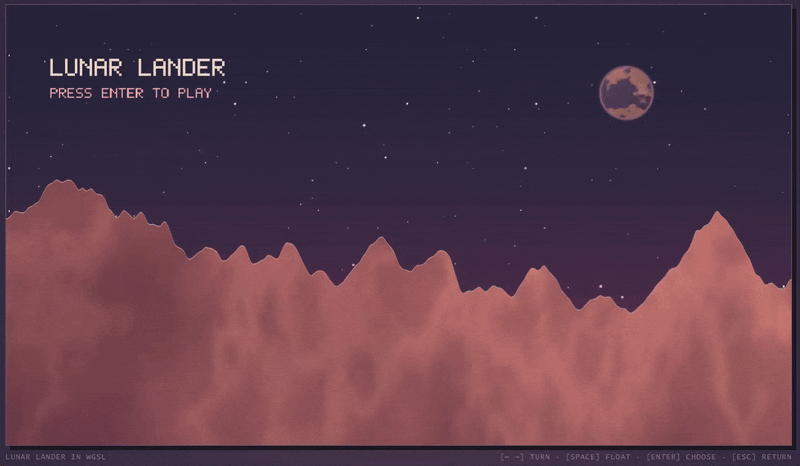

# Lunaland



A WebGPU/WGSL port of the original multi-pass Shadertoy Lunar Lander. The game runs at a fixed 1280x720 internal resolution and scales to the available window. The port preserves the original state machine, GPU-side physics, fuel economy, landing checks, score multipliers, menu flow, and bitmap-inspired presentation.

## Run

```powershell
npm run dev # http://127.0.0.1:4173
npm run check
```

## License

The source shaders identify the original work as Space Lander under GPLv2. This port retains the same licensing requirement and is licensed under the [GNU General Public License v2.0 only](LICENSE).
